# spring_introduction

---

<h3>라이브러리</h3>

Spring Web, Thymeleaf 2가지만 추가 했지만 의존 관계인 external library들도 다 가져옴
<br>
- spring-boot-starter-logging
    - println으로 출력하면 안된다. log로 출력해야 심각한 에러만 따로 모으고 관리할 수 있구
    - logback
    - slf4j
- spring-boot-starter-test
  - junit: 테스트 프레임워크
  - mockito: mock, flutter 에도 있음
  - assertj: 테스트 코드를 좀 더 편하게 작성하게 도와줌
  - spring-test: 스프링 통합 테스트 지원


<h3>웰컴 페이지</h3>
궁금한게 있으면 https://spring.io/ 여기서 찾아라

static에 index.html을 생성하면 웰컴페이지 기능을 함
템플릿 엔진을 사용하면 동적인 화면을 만들 수 있다.

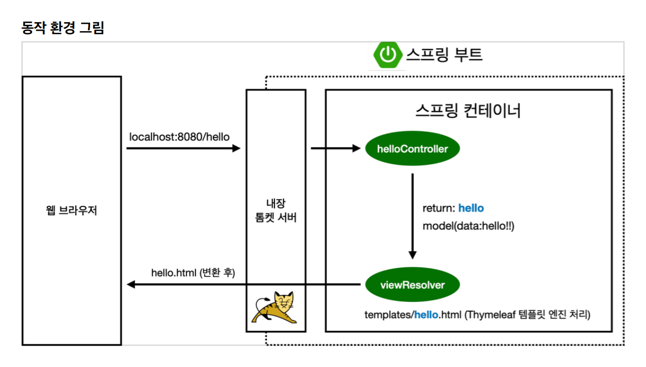
helloController의 GetMapping은 GET method의 그 GET이다.
spring이 여기서 모델을 만들어주는데 예시에서 key는 'data', value는 'hello!!'로 넣어주었다.
<br>
여기서 return의 이름이 'hello' 였다. 그러면 resources의 templates의 hello를 찾아서 렌더링한다.
화면을 찾는 것은 viewResolver가 한다.
- resources:templates/ +{ViewName}+ .html


<h3>빌드하고 실행하기</h3>

- ./gradlew build 
- cd build/libs 
- java -jar hello-spring-0.0.1-SNAPSHOT.jar

서버 배포할 때 hello-spring-0.0.1-SNAPSHOT.jar 이 파일만 복사해서 서버에 넣고 java -jar 해서 실행시키면 된다. 

안되면 ./gradlew clean build로 다시 실행


<h3>웹을 개발한다는 것은</h3>

1.정적 컨텐츠

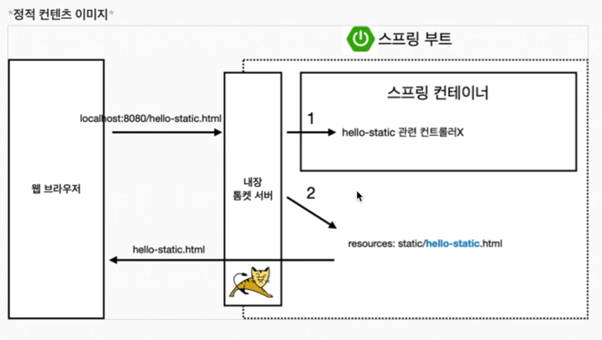

```java
서버에서 뭔가를 하지 않고 그냥 파일을 웹브라우저에 내려준다.
스프링 부트는 정적 컨텐츠 기능을 자동으로 제공한다.

resources/static에 html 파일을 넣으면 웹브라우저에서 보여줄 수 있다.

1. 스프링 컨테이너에서 먼저 controller 쪽에 hello-static이 있는지 찾아본다.
2. 없으면 resources/static/hello-static.html을 찾아서 있으면 반환해준다.
```

2. MVC와 템플릿 엔진

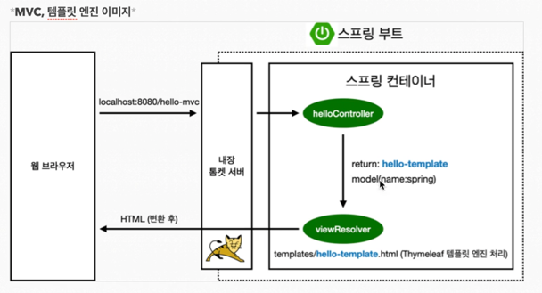

```java
jsp, php 같은것들이 템플릿 엔진이다. html을 그냥 주는게 아니라 서버에서 프로그래밍을 해서 html을 동적으로 변경해서 내려준다.
이것을 하기위해서 controller, model, 템플릿 엔진화면 3가지를 mvc라고 한다.(model, view, controller)
view : 화면을 그리는데 모든 역량을 집중
model, controller : 비즈니스 로직 관련

```

3. API

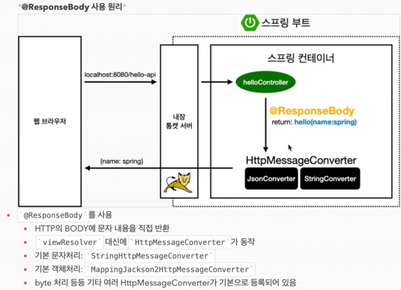

```java
json format으로 client에 데이터를 전달하는 방식
@ResponseBody 어노테이션이 있으면 viewResolver에게 넘기지 않고 응답을 그대로 넘기도록 동작한다.
그런데 여기서 문자가 아니라 객체라면 디폴트는 json형태로 만들어서 http 응답에 반환한다.

viewResolver 대신 HttpMessageConverter가 동작한다.
단순히 문자면 StringConverter, 객체면 JsonConverter가 동작한다.
```


<h3>회원 관리 예제</h3>

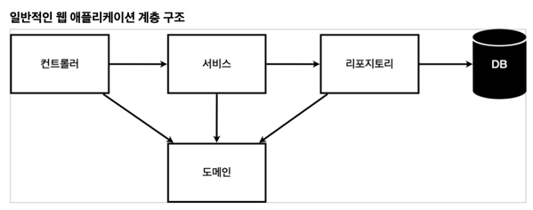

```java
컨트롤러: 웹 MVC의 컨트롤러 역할, API 만들때 역할한다. 
서비스: 핵심 비즈니스 로직 구현 e.g. 회원 중복 가입이 안된다.
리포지토리: 데이터베이스에 접근, 도메인 객체를 DB에 저장하고 관리
도메인: 비즈니스 도메인 객체, e.g. 회원, 주문, 쿠폰 등등 주로 데이터베이스에 저장하고 관리됨
```

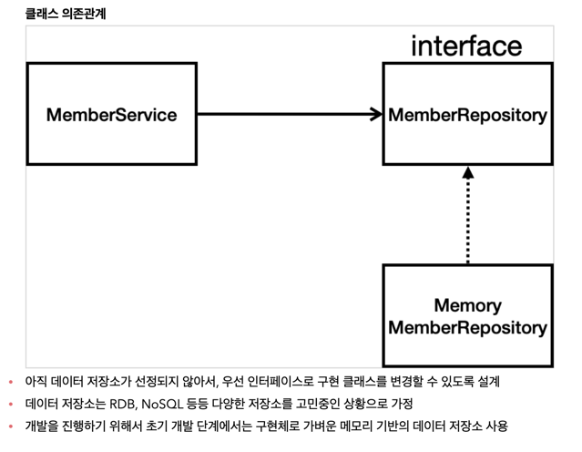


<h3>스프링 빈과 의존관계</h3>
```java
스프링 컨테이너가 Controller annotation이 있으면 MemberController 객체를 생성해서 넣어두고 관리한다.
스프링 컨테이너에서 스프링 빈이 관리된다고 표현한다.

@Autowired : 스프링이 연관된 객체를 스프링 컨테이너에서 찾아서 넣어준다. 이렇게 객체 의존관계를 외부에서 넣어주는 것을 DI (Dependency Injection), 의존성 주입이라 한다.
```

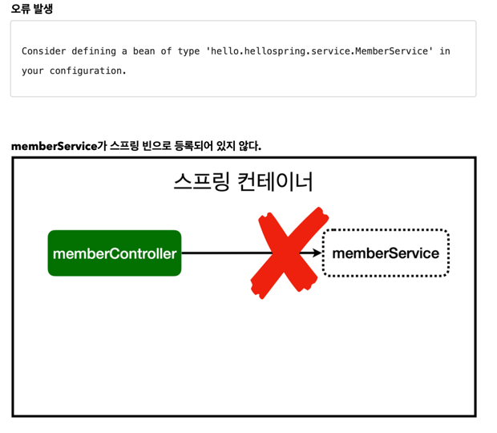

```java
@Service annotation 작성해줘야 한다.
```
<br>

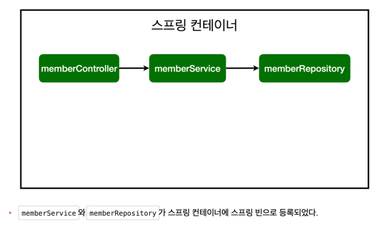

<h4>스프링 빈을 등록하는 2가지 방법</h4>

```java
1. 컴포넌트 스캔과 자동 의존관계 설정 : @Autowired, @Service, @Repository, @Controller annotation 붙이기
```

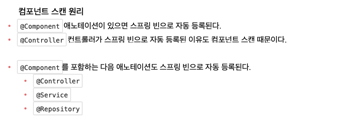

```java
스프링은 스프링 컨테이너에 스프링 빈을 등록할 때, 기본으로 싱글톤으로 등록한다.(유일하게 하나만 등록해서 공유한다)
따라서 같은 스프링 빈이면 모두 같은 인스턴스다. 설정으로 싱글톤이 아니게 설정할 수 있지만, 특별한 경우를 제외하면 대부분 싱글톤을 사용한다.
```

```java
2. 자바 코드로 직접 스프링 빈 등록하기

@Configuration
@Bean
사용해서 등록한다.
```

<h3>스프링 DB 접근 기술</h3>

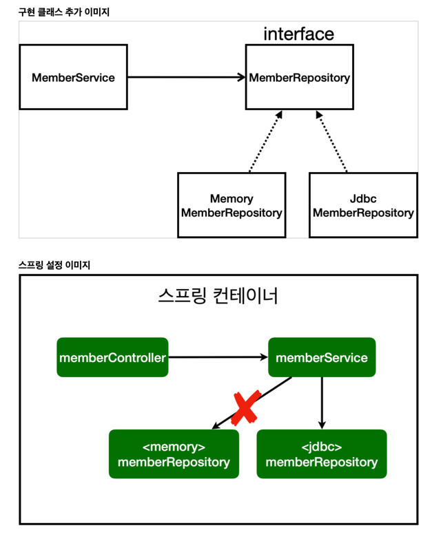

```java
개방 폐쇄 원칙(OCP, Open-Closed Principle) : 확장에는 열려있고, 수정, 변경에는 닫혀있다.
스프링의 DI (Dependencies Injection)을 사용하면 기존 코드를 전혀 손대지 않고, 설정만으로 구현 클래스를 변경할 수 있다.
```

<br>

<h4>JPA</h4>

```java
JPA는 기존의 반복 코드는 물론이고, 기본적인 SQL도 JPA가 직접 만들어서 실행해준다.
JPA를 사용하면, SQL과 데이터 중심의 설계에서 객체 중심의 설계로 패러다임을 전환을 할 수 있다.
JPA를 사용하면 개발 생산성을 크게 높일 수 있다.

ORM이다. 객체와 관계형 데이터베이스의 데이터를 자동으로 매핑(연결)해주는 것을 말한다
```

```java
show-sql : JPA가 생성하는 SQL을 출력
ddl-auto : JPA는 테이블을 자동으로 생성하는 기능을 제공하는데 none를 사용하면 해당 기능을 끈다.
-> create를 사용하면 엔티티 정보를 바탕으로 테이블도 직접 생성해준다.
```

<br>

<h4>Spring Data JPA</h4>

```java
스프링 데이터 JPA가 SpringDataJpaMemberRepository 를 스프링 빈으로 자동 등록해준다.
```

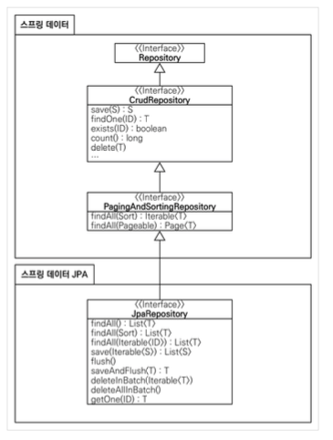

```java
스프링 데이터 JPA 제공 기능
- 인터페이스를 통한 기본적인 CRUD
- findByName(), findByEmail()처럼 메서드 이름만으로 조회 기능 제공
- 페이징 기능 자동 제공

** 실무에서는 JPA와 스프링 데이터 JPA를 기본으로 사용하고, 복잡한 동적 쿼리는 Querydsl이라는 라이브러리를 사용하면 된다.
** Querydsl을 사용하면 쿼리도 자바 코드로 안전하게 작성할 수 있고, 동적 쿼리도 편리하게 작성할 수 있다.
** 이 조합으로 해결하기 어려운 쿼리는 JPA가 제공하는 네이티브 쿼리를 사용하거나, 스프링 JdbcTemplate를 사용하면 된다.
```

<br>

<h3>AOP</h3>

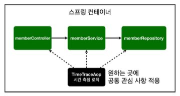

```java
공통 관심 사항 : cross-cutting concern e.g. 시간측정하는 로직
핵심 관심 사항 : core concern e.g. 회원가입 중복 확인하는 로직

AOP : Aspect Orientd Programming
- 핵심 관심 사항 과 공통 관심 사항을 분리한다.
- 핵심 관심 사항을 깔끔하게 유지할 수 있다.
- 변경이 필요하면 이 로직만 변경하면 된다.
- 원하는 적용 대상을 선택할 수 있다.
```

<br>

<h4>AOP 적용 전</h4>

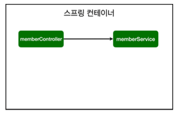
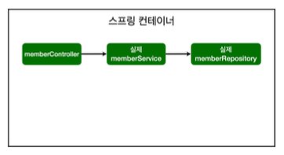

<h4>AOP 적용 후</h4>
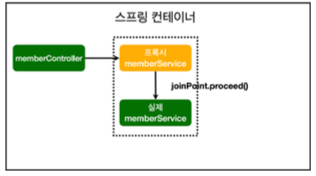
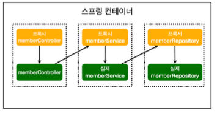
