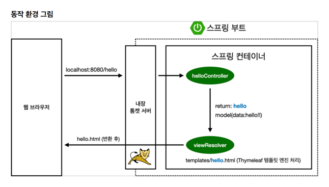

# spring_introduction

---

<h3>라이브러리</h3>

Spring Web, Thymeleaf 2가지만 추가 했지만 의존 관계인 external library들도 다 가져옴
 
- spring-boot-starter-logging
    - println으로 출력하면 안된다. log로 출력해야 심각한 에러만 따로 모으고 관리할 수 있구
    - logback
    - slf4j
- spring-boot-starter-test
  - junit: 테스트 프레임워크
  - mockito: mock, flutter 에도 있음
  - assertj: 테스트 코드를 좀 더 편하게 작성하게 도와줌
  - spring-test: 스프링 통합 테스트 지원

<h3>웰컴 페이지</h3>
궁금한게 있으면 https://spring.io/ 여기서 찾아라

static에 index.html을 생성하면 웰컴페이지 기능을 함
템플릿 엔진을 사용하면 동적인 화면을 만들 수 있다.

helloController의 GetMapping은 GET method의 그 GET이다.
spring이 여기서 모델을 만들어주는데 예시에서 key는 'data', value는 'hello!!'로 넣어주었다.
 
여기서 return의 이름이 'hello' 였다. 그러면 resources의 templates의 hello를 찾아서 렌더링한다.
화면을 찾는 것은 viewResolver가 한다.
- resources:templates/ +{ViewName}+ .html

<h3>빌드하고 실행하기</h3>
- ./gradlew build 
- cd build/libs 
- java -jar hello-spring-0.0.1-SNAPSHOT.jar

서버 배포할 때 hello-spring-0.0.1-SNAPSHOT.jar 이 파일만 복사해서 서버에 넣고 java -jar 해서 실행시키면 된다. 

안되면 ./gradlew clean build로 다시 실행